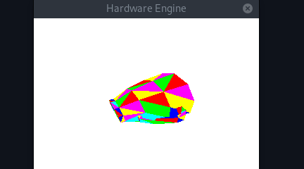

# Tiny Graphics Accelerator
Design to be use as a standalone 3D graphics accelerator. 
Was created to be used with a embedded RISC-V processor and implemented in a FPGA.




# Compilation
The project simulation and tests can be compiled in `linux` using `verilator` v5.034 and `make`
```sh
make
```

# Software Simulation
The rasterizer algorithm can be simulated in `linux` using `verilator` v5.034 and `glfw3`
```sh
make sim
```
You can run then individualy with
```sh
./build/rasterizer_sim
```
The object can be moved with the keys `W` `A` `S` `D` `Q` `E` `U` `I`.

# Tests
Tests can be compiled with
```sh
make test
```
You can run then individualy with
```sh
./build/rasterizer_test
```

